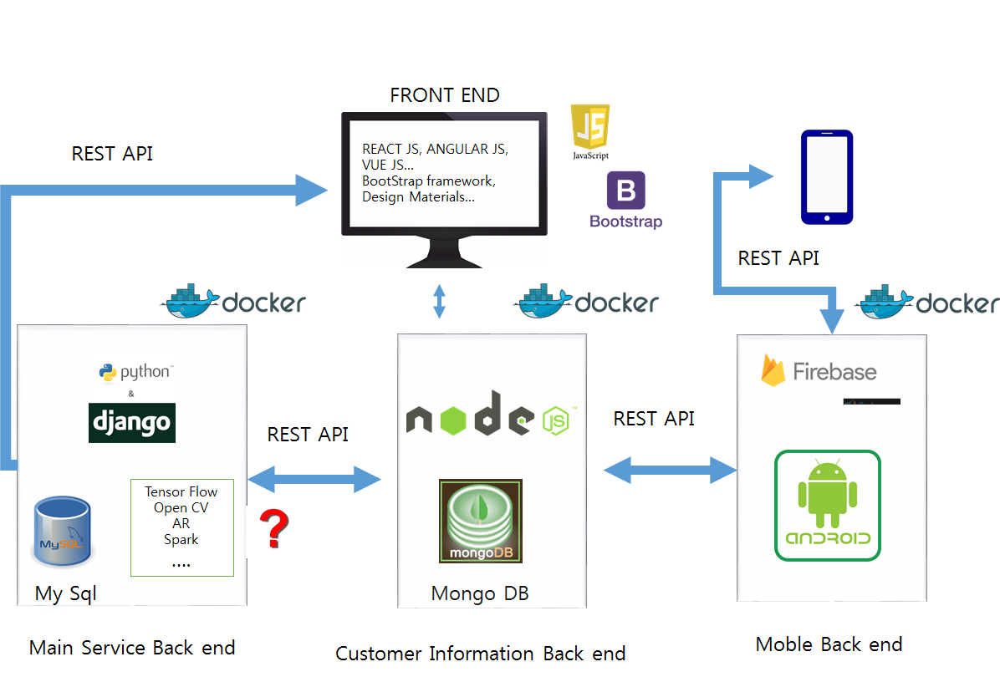

## CAPSTONE DESIGN
## micro service architecture system

0. 프로젝트 취지

   Micro service design으로 여러가지 기술들을 융합하고 구현하고 경험하고자 합니다. 저희 조는 팀원을 구성할 때 배우고 싶은 기술이 비슷한 구성원들을 최우선으로 하였습니다. 비록 Main service의 주제는 회의 중이지만, 저희 조가 최우선으로 생각하는 목표는 Micro service architecture의 System을 구현하고 운영하고 유지 보수 하는 일입니다. 시도하는 기술의 폭이 비교적 많지만, 주기적인 스터디와 협업으로 다 같이 배우고 경험하는 프로젝트가 되었으면 합니다.   
 
 1. 프로젝트 예상 구성도

Microservice Architecture  

 저희 조는 System을 크게 4가지로 기능별로 구분하였습니다. 서비스는 아직 정하지 못했지만 메인 서비스 로직을 담당하고 있는 시스템과, 고객들의 정보를 관리하고 인증하는 고객 관리 시스템, 모바일 관련 서비스를 담당하는 시스템 이를 표현하는 프론트로 구분 하였습니다. 마이크로서비스 아키텍쳐를 활용해 다른 언어로 짜여진 각각의 서비스를 손쉽게 붙이는 것을 실습 해 보고자 하였습니다. 그리고 각 서비스는 요즘 많이 쓰이는 docker를 활용하여 각 서비스의 패키징을 하는 것을 경험하고자 이렇게 설계를 해 보았습니다. 모바일의 센서가 필요한 주제가 정해지면 뒷 단은 유지하되 모바일 쪽 위주로 구현하는 것이 어떨지 회의하였습니다. 
 
 2. 기술 STACK (이번 프로젝트에서 사용하거나 배우고 싶은 기술들)

Front 

- React JS  
- Angular JS  
- Vue JS  

 Java Script를 모르면 웹에 관련된 프로젝트를 진행 할 수 없을 정도로 java script가 많이 사용되어 지고 있습니다. 이번 기회를 통해 java script에 친숙해 지고 싶습니다.
 

- Bootstrap 
- Design Materials 

웹 서비스를 구성 할 때 서비스 로직 만큼이나 보여지는 디자인과 UI도 중요합니다. 이러한 UI를 쉽고 효율 적으로 생성해주는 framework를 사용해 봄으로 써 웹 디자인에 대한 경험을 쌓고 싶습니다.  

DB 및 서버 관리 

- Docker 
- MySQL 
- 몽고DB 
- FireBase 
아마존 AWS 

Docker 같은 컨테이너 기술 덕분에 서비스를 구현하고 배포하기가 용이해 졌습니다. 이러한 기술을 사용해보고 경험해 봄으로써 현업에서 사용하는 기술에대한 이해를 넓히고 싶습니다. 

Web framework 

- Django 
- Node JS 
 Front end에서만 쓰이던 Java Script를 Back End에서도 사용 가능하게 해주기 때문에 최근에 많은 관심을 받고 있기 때문에 사용해 보고 싶습니다. 학교에서 필수적으로 Python을 배우고 있습니다. python은 Django라는 좋은 웹 프레임워크를 가지고 있으며, 현업에서 많이 사용되어지고 있습니다. 학교에서 배운 python지식을 이용해 실제로 사용할 수 있는 web service를 구현해보고 싶습니다.  

Main service 

- Tensor flow 
- Spark 
- Open CV 
- IOT 
- Google API 
- Android 
